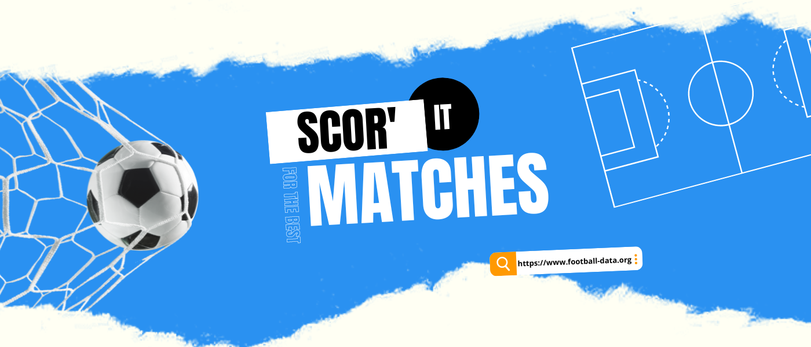
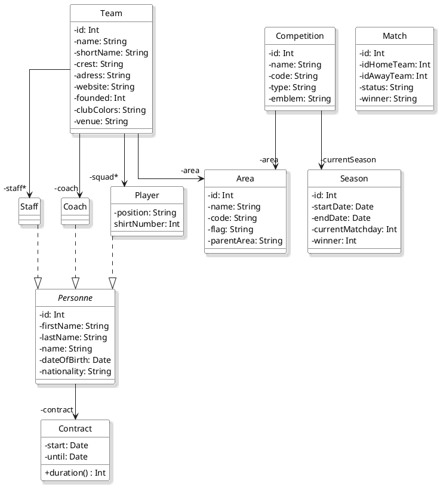
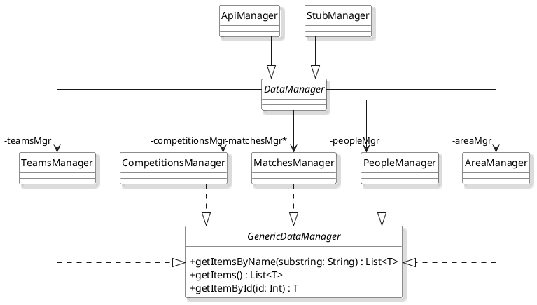

---

&nbsp; 
&nbsp; 
&nbsp; 
 

---

**Contexte** : Scor'It est une application mobile pour *Android* sur le thème du football :soccer:. Son objectif est de répertorier tous les championnats, équipes, joueurs, etc. afin de permettre à l'utilisateur de les ajouter en favoris et de visualiser les matchs récents correspondants.

API : https://www.football-data.org/documentation/quickstart (Football Data)

IDE : https://developer.android.com/studio (Android Studio)

## :bookmark_tabs: Fonctionnement

### Diagramme de classes du modèle :

### Diagramme de classes des interfaces et classes de gestion de l'accées aux données :

## :construction_worker: Technicien en charge de l'application

⚙️ Emre KARTAL

⚙️ Baptiste MARCEL

© IUT - Auvergne

