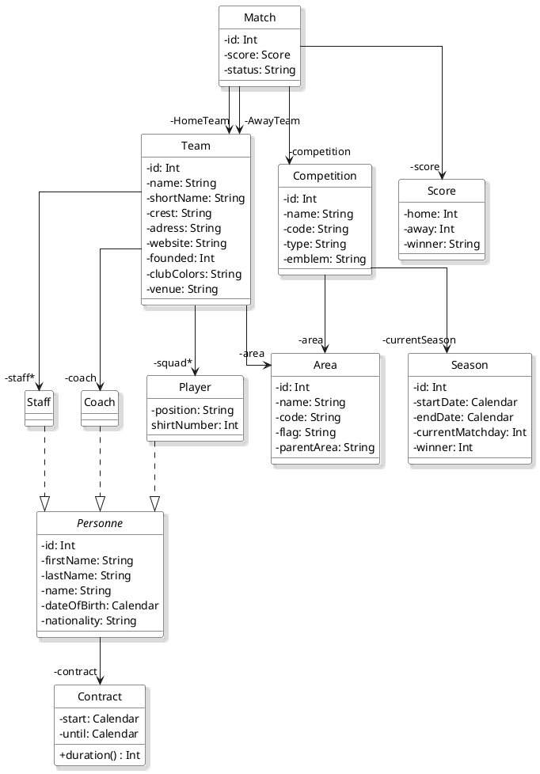
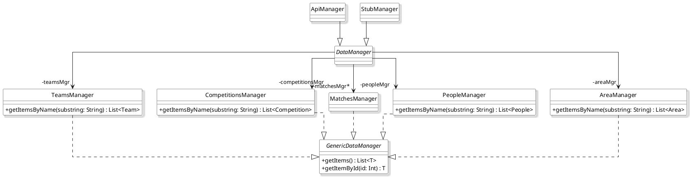

<div align = center>


</div>

<div align = center>

---

&nbsp; 
&nbsp; 
&nbsp; 
&nbsp; 

[](https://codefirst.iut.uca.fr/sonar/dashboard?id=Scor_It)
[](https://codefirst.iut.uca.fr/sonar/dashboard?id=Scor_It)
[](https://codefirst.iut.uca.fr/sonar/dashboard?id=Scor_It)
[](https://codefirst.iut.uca.fr/sonar/dashboard?id=Scor_It)
[](https://codefirst.iut.uca.fr/sonar/dashboard?id=Scor_It)

---

</div>

**Contexte** : Scor'It est une application mobile pour *Android* sur le thème du football :soccer:. Son objectif est de répertorier tous les championnats, équipes, joueurs, etc. afin de permettre à l'utilisateur de les ajouter en favoris et de visualiser les matchs récents correspondants.


API : https://www.football-data.org/documentation/quickstart (Football Data)

IDE : https://developer.android.com/studio (Android Studio)

## :bookmark_tabs: Fonctionnement

### Diagramme de classes du modèle :



### Diagramme de classes des interfaces et classes de gestion de l'accées aux données :



## Avancement du projet 

<u>Où en sommes-nous</u>:grey_question::grey_exclamation: (:white_check_mark: réalisé, :warning: presque abouti, :x: non commencé )

```Côté vue:```

- :white_check_mark: [**Partie 1**](src/EntityFramework_Lol/Sources/ApiLol/Controllers) : **Réalisation de la vue Start Page**

- :white_check_mark: [**Partie 2**](src/EntityFramework_Lol/Sources/ApiLol/Controllers) : **Réalisation de la vue Home Page**

- :white_check_mark: [**Partie 3**](src/EntityFramework_Lol/Sources/ApiLol/Controllers) : **Réalisation de la vue Favorite Page**

- :white_check_mark: [**Partie 4**](src/EntityFramework_Lol/Sources/Tests/ApiTests) : **Réalisation de la vue Detail Competition Page**

- :x: [**Partie 5**](.drone.yml) : **Réalisation de la vue Team Detail Page**

```Côté back-end:```

- :white_check_mark: [**Partie 1**](src/EntityFramework_Lol/Sources/ApiLol/Controllers) : **Réalisation de la navigation entre les fragments**

- :white_check_mark: [**Partie 2**](src/EntityFramework_Lol/Sources/ApiLol/Controllers) : **Master Detail**

- :white_check_mark: [**Partie 3**](src/EntityFramework_Lol/Sources/ApiLol/Controllers) : **Appelle à l'API**

- :white_check_mark: [**Partie 4**](src/EntityFramework_Lol/Sources/Tests/ApiTests) : **Gyroscope pour le ballon de foot**

- :white_check_mark: [**Partie 5**](.drone.yml) : **Conception et réalisation du Model**

- :warning: [**Partie 6**](.drone.yml) : **Persistance des donnéees**

- :white_check_mark: [**Partie 7**](.drone.yml) : **Réalisation de la barre de recherche**

- :x: [**Partie 8**](.drone.yml) : **Affichage des images SVG**

```Autre:```

- :white_check_mark: [**Partie 1**](src/EntityFramework_Lol/Sources/ApiLol/Controllers) : **Mise en place de SonarQube**

## :construction_worker: Technicien en charge de l'application

- Emre KARTAL : Emre.KARTAL@etu.uca.fr
- Baptiste MARCEL : Baptiste.MARCEL@etu.uca.fr
<div align="center">
<a href = "https://codefirst.iut.uca.fr/git/emre.kartal">

</a>
<a href = "https://codefirst.iut.uca.fr/git/david.d_almeida">

</a>

© IUT - Auvergne
</div>